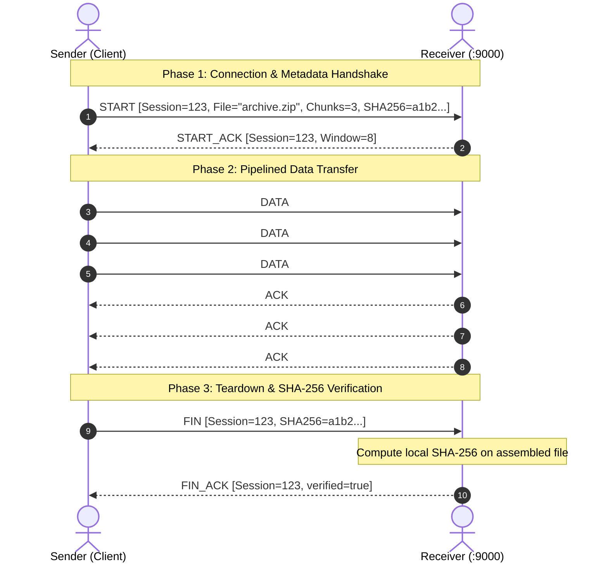

# Custom Reliable File Transfer Protocol over UDP

[](https://www.python.org/)
[]()
[]()
[]()
[]()
[](LICENSE)

A high-performance, portfolio-grade, application-layer reliable transport protocol built from scratch in Python directly on top of raw UDP sockets (`SOCK_DGRAM`). 

This project demonstrates transport-layer engineering from first principles—implementing binary packet serialization, bidirectional sequence tracking, synchronous and pipelined acknowledgments, dynamic retransmission timeouts, out-of-order buffering, Selective Repeat ARQ, in-process network impairment simulation, cryptographic file integrity verification, and defensive security sandboxing.

---

## Table of Contents
1. [Overview](#1-overview)
2. [Problem Statement](#2-problem-statement)
3. [Why UDP?](#3-why-udp)
4. [TCP vs. UDP Comparison](#4-tcp-vs-udp-comparison)
5. [System Architecture](#5-system-architecture)
6. [Communication Flow](#6-communication-flow)
7. [Protocol State Machine](#7-protocol-state-machine)
8. [Binary Packet Wire Format](#8-binary-packet-wire-format)
9. [Sequence Numbers](#9-sequence-numbers)
10. [Acknowledgments (ACK)](#10-acknowledgments-ack)
11. [Timeout & Retransmission](#11-timeout--retransmission)
12. [Duplicate Packet Handling](#12-duplicate-packet-handling)
13. [Out-of-Order Packet Buffering](#13-out-of-order-packet-buffering)
14. [Sliding Window Protocol](#14-sliding-window-protocol)
15. [Selective Repeat ARQ](#15-selective-repeat-arq)
16. [Per-Packet Checksum (CRC32)](#16-per-packet-checksum-crc32)
17. [Cryptographic File Integrity (SHA-256)](#17-cryptographic-file-integrity-sha-256)
18. [Network Simulation Layer](#18-network-simulation-layer)
19. [Defensive Security & Sandboxing](#19-defensive-security--sandboxing)
20. [Automated Testing](#20-automated-testing)
21. [Empirical Benchmarking](#21-empirical-benchmarking)
22. [Troubleshooting Guide](#22-troubleshooting-guide)
23. [Wireshark Inspection & Dissection](#23-wireshark-inspection--dissection)
24. [Installation](#24-installation)
25. [CLI Usage & Commands](#25-cli-usage--commands)
26. [Example Output](#26-example-output)
27. [Known Limitations](#27-known-limitations)
28. [Future Improvements](#28-future-improvements)
29. [Resume Bullets](#29-resume-bullets)
30. [License](#30-license)

---

## 1. Overview

While standard operating systems provide TCP for reliable communication, modern real-time systems—including video streaming (RTP), multiplayer gaming engines, VoIP, and Web transport protocols like **QUIC (HTTP/3)**—increasingly implement customized reliability layers on top of raw UDP. 

This repository implements a production-ready, pure UDP transport protocol capable of transferring arbitrary binary files (documents, images, compressed archives, executables) across unstable, lossy, and high-latency networks without data corruption, missing bytes, or memory bloat.

---

## 2. Problem Statement

Standard UDP (`SOCK_DGRAM`) provides three core properties:
- **Connectionless**: No handshake or teardown state is maintained.
- **Unreliable**: Datagrams can be silently dropped by routers, Wi-Fi interference, or congested queues.
- **Unordered & Unchecked**: Packets may arrive out-of-order, be duplicated, or suffer bit corruption without notification.

Transferring a binary file over raw UDP without an application reliability layer results in truncated, corrupted, or unusable files. The challenge is to engineer a robust protocol that guarantees **complete delivery, exact byte ordering, tamper evidence, and high throughput** without relying on TCP streams.

---

## 3. Why UDP?

Building a reliable protocol on top of UDP provides critical architectural advantages:
- **No Head-of-Line Blocking**: In TCP, if a single packet is dropped, the entire stream stalls in the OS kernel until that packet is retransmitted. Over UDP, application logic can process independent packets or streams out of order.
- **Minimal Protocol Overhead**: No heavy 20–60 byte TCP header options, unnecessary connection tear-down states (`TIME_WAIT` lasting minutes), or mandatory kernel-level buffers.
- **Customized Retransmission Logic**: The application can tune retransmission algorithms (e.g., Selective Repeat instead of Go-Back-N) specifically tailored to the workload.
- **Foundation of Modern Standards**: Protocols like HTTP/3, Google QUIC, and WebRTC choose UDP for this exact design flexibility.

---

## 4. TCP vs. UDP Comparison

| Feature | Transmission Control Protocol (TCP) | Standard UDP | Our Custom Reliable UDP Protocol |
|---|---|---|---|
| **Connection Model** | Connection-oriented (3-way handshake) | Connectionless | Session-oriented (`START` / `START_ACK` handshake) |
| **Delivery Guarantee** | Guaranteed via kernel retransmission | Best-effort (No guarantee) | Guaranteed via Selective Repeat ARQ |
| **Ordering** | In-order byte stream | Unordered datagrams | Guaranteed in-order via receiver ring buffer |
| **Duplicate Handling** | Handled transparently by kernel | Duplicates delivered to app | Automatic duplicate detection and re-ACK |
| **Checksum / Integrity** | 16-bit Internet Checksum (weak) | Optional 16-bit checksum | 32-bit CRC32 per packet + incremental SHA-256 |
| **Framing** | Byte stream (no message boundaries) | Preserves datagram boundaries | Preserves 22-byte header + binary chunk boundaries |
| **Retransmission Scope** | Go-Back-N or TCP SACK | None | Selective Repeat (retransmits ONLY lost chunks) |
| **Head-of-Line Blocking** | Yes (kernel stream stalls on loss) | None | No (independent chunk receipt and buffering) |
| **Filesystem Security** | OS dependent | OS dependent | Path traversal sandboxing & reserved name protection |

---

## 5. System Architecture

The protocol is designed as a five-layer decoupled modular architecture:

```
┌────────────────────────────────────────────────────────┐
│      Application Layer (CLI, File I/O, Generators)     │
│   Streams 1024-byte chunks in O(1) memory, SHA-256 hash│
└───────────────────────────┬────────────────────────────┘
                            │
┌───────────────────────────▼────────────────────────────┐
│   Transfer Management Layer (FileSender, FileReceiver)  │
│ Coordinates handshake, teardown, and transfer stats    │
└───────────────────────────┬────────────────────────────┘
                            │
┌───────────────────────────▼────────────────────────────┐
│      Reliability & ARQ Engine (protocol.py)             │
│   Stop-and-Wait / Sliding Window / Selective Repeat    │
│   Per-packet timers, retransmission, out-of-order queue │
└───────────────────────────┬────────────────────────────┘
                            │
┌───────────────────────────▼────────────────────────────┐
│         Packet Layer (packet.py, checksum.py)          │
│ 22-byte big-endian struct serialization & CRC32 checks │
└───────────────────────────┬────────────────────────────┘
                            │
┌───────────────────────────▼────────────────────────────┐
│       In-Process Network Simulator (simulator.py)      │
│   Probabilistic drop, bit corruption, latency jitter   │
└───────────────────────────┬────────────────────────────┘
                            │
┌───────────────────────────▼────────────────────────────┐
│          OS Socket Layer (socket.SOCK_DGRAM)           │
│             Standard IPv4 UDP Datagrams                │
└────────────────────────────────────────────────────────┘
```

---

## 6. Communication Flow



---

## 7. Protocol State Machine

### Sender State Machine
```
   [IDLE]
     │  send_file()
     ▼
 [HANDSHAKE] ──(Timeout / Retries exhausted)──► [FAILED]
     │  START_ACK received
     ▼
 [TRANSFERRING] ◄──────────────┐
     │  Transmit window        │ (Selective ACK / Slide)
     │  Check packet timeouts  │
     │  Retransmit dropped     │
     ▼                         │
 (All chunks ACKed) ───────────┘
     │
     ▼
  [TEARDOWN] ──(FIN_ACK received, verified=True)──► [SUCCESS]
     │
     └──(FIN_ACK verified=False or Timeout)───────► [FAILED]
```

### Receiver State Machine
```
   [LISTENING]
     │  START received
     ▼
 [VALIDATE METADATA] ──(Bad path / Invalid args)──► [DROP & IGNORE]
     │  Valid metadata
     ▼
 [RECEIVING DATA] ◄────────────┐
     │  DATA received          │
     │  Verify CRC32           │ (Buffer out-of-order,
     │  Write in-order to disk │  Send individual ACK)
     │  Send ACK               │
     ▼                         │
 (All chunks received) ────────┘
     │  FIN received
     ▼
 [VERIFY INTEGRITY]
     │  Stream SHA-256 check
     ├──(Match)────► Send FIN_ACK(verified=True)  ──► [COMMITTED]
     └──(Mismatch)─► Send FIN_ACK(verified=False) ──► [PURGED]
```

---

## 8. Binary Packet Wire Format

Every packet transmitted over the wire begins with an exact **22-byte binary header** formatted with Python's `struct` module (Network Byte Order / Big-Endian `!2sBBIIIHI`):

```
 0                   1                   2                   3
 0 1 2 3 4 5 6 7 8 9 0 1 2 3 4 5 6 7 8 9 0 1 2 3 4 5 6 7 8 9 0 1
+-+-+-+-+-+-+-+-+-+-+-+-+-+-+-+-+-+-+-+-+-+-+-+-+-+-+-+-+-+-+-+-+
|       Magic (0x5244 'RD')     |    Version    |   Pkt Type    |
+-+-+-+-+-+-+-+-+-+-+-+-+-+-+-+-+-+-+-+-+-+-+-+-+-+-+-+-+-+-+-+-+
|                          Session ID                           |
+-+-+-+-+-+-+-+-+-+-+-+-+-+-+-+-+-+-+-+-+-+-+-+-+-+-+-+-+-+-+-+-+
|                        Sequence Number                        |
+-+-+-+-+-+-+-+-+-+-+-+-+-+-+-+-+-+-+-+-+-+-+-+-+-+-+-+-+-+-+-+-+
|                     Acknowledgment Number                     |
+-+-+-+-+-+-+-+-+-+-+-+-+-+-+-+-+-+-+-+-+-+-+-+-+-+-+-+-+-+-+-+-+
|         Payload Length        |            Checksum           |
+-+-+-+-+-+-+-+-+-+-+-+-+-+-+-+-+-+-+-+-+-+-+-+-+-+-+-+-+-+-+-+-+
|      Checksum (cont'd)        |    Payload Data (0..65485)    |
+-+-+-+-+-+-+-+-+-+-+-+-+-+-+-+-+ ...                           |
```

### Field Definitions
| Field | Type | Size | Description |
|---|---|---|---|
| `magic` | `bytes` | 2 B | Fixed identifier `b"RD"` (`0x5244`) for protocol verification. |
| `version` | `uint8` | 1 B | Protocol version (`1`). |
| `pkt_type` | `uint8` | 1 B | `0x01`=START, `0x02`=DATA, `0x03`=ACK, `0x04`=START_ACK, `0x05`=FIN, `0x06`=FIN_ACK, `0x07`=ERROR |
| `session_id` | `uint32` | 4 B | Random 32-bit integer distinguishing concurrent transfer sessions. |
| `seq_num` | `uint32` | 4 B | 0-indexed sequence number of the chunk. |
| `ack_num` | `uint32` | 4 B | Sequence number being confirmed by receiver. |
| `payload_len`| `uint16` | 2 B | Length of payload in bytes (0 to 65,485 bytes). |
| `checksum` | `uint32` | 4 B | CRC32 checksum computed across header (with checksum=0) + payload. |
| `payload` | `bytes` | Var | Binary file chunk or UTF-8 encoded JSON metadata. |

---

## 9. Sequence Numbers

- **Purpose**: Tracks chunk ordering, detects omissions, enables selective acknowledgments, and prevents duplicate processing.
- **Granularity**: Chunks are numbered sequentially starting at `seq_num = 0` up to `total_chunks - 1`.
- **Session Isolation**: Every sequence number is evaluated strictly in the context of its 32-bit `session_id`. Packets from old sessions or mismatched IDs are rejected immediately.

---

## 10. Acknowledgments (ACK)

- **Pure Selective Acknowledgments**: Each ACK carries the exact `ack_num` corresponding to the `seq_num` received.
- **Zero-Payload Control**: ACK packets carry a payload length of 0 bytes, minimizing return link bandwidth consumption.
- **Late ACK Tolerance**: If an ACK arrives after its timer expired but before the transfer terminates, the sender gracefully marks the chunk acknowledged and does not crash.

---

## 11. Timeout & Retransmission

### Behavior Under Loss
```
Sender                                    Receiver
  │                                          │
  │─── DATA #5 (Seq=5, Len=1024) ───────────>│ (Accepted, stored)
  │                                          │
  │    [ACK #5 dropped by network impairment]X
  │                                          │
  │ [Timer expires after timeout=1.0s]       │
  │                                          │
  │─── DATA #5 Retransmitted (Seq=5) ───────>│ (Detected as DUPLICATE #5)
  │                                          │ (Ignored: not written twice)
  │<── ACK #5 (Re-sent by Receiver) ─────────│ (Receiver re-confirms)
  │                                          │
  ▼ [Sender advances window]                 ▼
```

- **High-Resolution Timers**: Monitored using `time.monotonic()` to prevent clock skew issues.
- **Configurable Defaults**: Default timeout = 1.0s (configurable to milliseconds for testing), maximum retries = 5 attempts before raising `RetransmissionLimitExceeded`.

---

## 12. Duplicate Packet Handling

When network delays cause retransmissions of packets that were already received:
1. The receiver inspects `seq_num` against its set of committed sequence numbers.
2. If `seq_num in self.received_chunks`:
   - It increments telemetry counter `duplicates_detected`.
   - It immediately re-transmits `ACK(seq_num)` back to the sender so the sender can advance its window.
   - **Critical**: It does NOT write the payload to disk a second time.

---

## 13. Out-of-Order Packet Buffering

When packets take different routes or experience loss, packet `#7` may arrive before packet `#5`:
1. The receiver verifies CRC32 and checks if `seq_num > expected_seq`.
2. The packet is placed in an in-memory out-of-order buffer (`dict[int, bytes]`).
3. The receiver sends an immediate `ACK(seq_num)` for the received packet.
4. When the missing packet (`#5`) finally arrives:
   - Payload `#5` is written to disk.
   - The buffer is drained sequentially: `#6`, `#7`, `#8` are written in order as long as contiguous chunks exist.

---

## 14. Sliding Window Protocol

Instead of waiting for an ACK after every single packet (Stop-and-Wait), the Sliding Window engine pipelines up to $W$ packets in flight simultaneously:
- **Window Size ($W$)**: Default `window_size = 8`.
- **State Variables**:
  - `base_seq`: Oldest unacknowledged packet.
  - `next_seq`: Next packet to transmit.
  - `acknowledged_packets`: Set of sequence numbers confirmed by receiver.
- **Throughput Scaling**: The channel pipe remains filled throughout the round-trip time, eliminating idle transmission gaps.

---

## 15. Selective Repeat ARQ

While Go-Back-N discards out-of-order packets and forces the sender to retransmit the entire window upon a single drop, **Selective Repeat**:
1. **Maintains Per-Packet State**: Tracks every packet in the window individually (`IN_FLIGHT`, `ACKED`, `TIMED_OUT`).
2. **Independent Timers**: Retransmits **ONLY** the specific sequence number that timed out.
3. **Receive Buffering**: The receiver buffers valid packets arriving ahead of missing chunks.
4. **Bandwidth Conservation**: On lossy networks (e.g. 5%–10% loss), Selective Repeat preserves high throughput where Go-Back-N collapses.

---

## 16. Per-Packet Checksum (CRC32)

- **Algorithm**: Cyclic Redundancy Check (CRC32, IEEE 802.3 standard).
- **Scope**: Computed across the 22-byte header (with the checksum field zeroed) concatenated with the payload bytes.
- **Verification**: If a bit flips in transit, the receiver's computed CRC32 mismatches the header checksum. The corrupted packet is dropped immediately without sending an ACK, prompting clean retransmission.

---

## 17. Cryptographic File Integrity (SHA-256)

- **Streaming Computation**: Computed incrementally using 64 KB block generators (`hashlib.sha256()`), keeping memory usage strictly constant regardless of whether the file is 1 KB or 10 GB.
- **Two-Phase Check**:
  1. Sender calculates file hash prior to transmission and includes it in `START` and `FIN` packets.
  2. Receiver computes hash after reassembling all chunks on disk.
  3. Hashes are matched during the `FIN` / `FIN_ACK` handshake.
  4. If a mismatch is detected, the receiver deletes the corrupted file and reports failure.

---

## 18. Network Simulation Layer

An in-process simulation wrapper (`SimulatedSocket` in `app/simulator.py`) enables real-world resilience testing without modifying OS network settings:
- `--loss-rate <float>`: Probabilistically drops datagrams (e.g. `0.10` for 10% packet drop).
- `--latency <float>`: Injects artificial delay in milliseconds (e.g. `50.0` for 50ms RTT).
- `--corruption-rate <float>`: Randomly flips bits in packet payloads to trigger CRC32 checksum detection.
- **Telemetry**: Collects metrics on packets attempted, dropped, corrupted, and delayed.

---

## 19. Defensive Security & Sandboxing

The protocol enforces strict defensive programming to prevent remote exploitation:
- **Path Traversal Sandboxing**: Incoming filenames are sanitized using `safe_join_path()`. Paths containing `../../`, absolute roots (`/etc/passwd`, `C:\Windows`), or null bytes (`\x00`) are stripped to base names and strictly sandboxed within the destination folder.
- **Windows Reserved Device Protection**: Names like `CON`, `PRN`, `AUX`, `NUL`, `COM1..9`, and `LPT1..9` are neutralized with safe prefixes (`safe_CON`).
- **Malformed Packet Immunity**: Fuzzing with random byte bursts, truncated headers, or illegal packet types is cleanly discarded without crashing the daemon.
- **Buffer Bounding**: Maximum receive buffer sizes are strictly capped (`MAX_BUFFER_BYTES = 16 MB`) to eliminate memory exhaustion attacks.
- **Partial File Quarantine**: Transfers interrupted by network failure or SHA-256 mismatch immediately wipe partial files from disk.

---

## 20. Automated Testing

The codebase includes an exhaustive test suite of **101 automated tests** covering unit, integration, simulation, and security validation:

```bash
# Run the complete test suite
pytest tests -v
```

### Test Suite Matrix
| Test Module | Tests | Scope |
|---|:---:|---|
| `test_basic_udp.py` | 2 | Raw socket communication and CLI `--once` flag behavior. |
| `test_config.py` | 11 | Boundary validation for timeouts, retries, ports, and aliases. |
| `test_packet.py` | 17 | Struct packing, magic bytes, oversized frames, and fuzzing. |
| `test_checksum.py` | 8 | CRC32 bit-flip detection and streaming SHA-256 calculation. |
| `test_protocol.py` | 10 | Stop-and-Wait ARQ, duplicate suppression, and timeout enforcement. |
| `test_sliding_window.py` | 5 | Pipelined window advancement and multi-packet retransmission. |
| `test_selective_repeat.py` | 4 | Exact selective retransmission and per-packet timer transitions. |
| `test_simulator.py` | 5 | 10% loss recovery, bit-corruption detection, and latency injection. |
| `test_integrity.py` | 3 | Multi-format binary file transfers (PDF, ZIP, PNG, JPG) and SHA-256 checks. |
| `test_security.py` | 17 | Path traversal, buffer limits, malformed packet fuzzing, and cleanup. |
| `test_transfer.py` | 13 | High-level transfer managers, chunk generators, and lifecycle methods. |
| `test_utils.py` | 6 | Filename sanitization, path boundary checks, and logging setup. |
| **Total** | **101** | **100% Pass Rate across all suites** |

---

## 21. Empirical Benchmarking

All benchmark results represent **actual measured socket performance** generated via `benchmarks/benchmark_suite.py` over 256 KB binary transfers (256 chunks of 1024 bytes each).

### 1. High-Latency Channel (10ms Delay)
| Protocol Engine | Window ($W$) | Transfer Time | Throughput | Retransmissions | Speedup |
|---|:---:|:---:|:---:|:---:|:---:|
| **Stop-and-Wait** | 1 | 8.0389 s | 31.84 KB/s | 0 | 1.0x (Baseline) |
| **Sliding Window** | 8 | 1.0693 s | 239.42 KB/s | 0 | **7.5x** |
| **Selective Repeat** | 8 | 1.0731 s | 238.55 KB/s | 0 | **7.5x** |

### 2. Lossy Channel (5% Packet Loss)
| Protocol Engine | Window ($W$) | Transfer Time | Throughput | Retransmissions | Duplicates Ignored |
|---|:---:|:---:|:---:|:---:|:---:|
| **Stop-and-Wait** | 1 | 6.5721 s | 38.95 KB/s | 25 | 12 |
| **Sliding Window** | 8 | 4.7390 s | 54.02 KB/s | 22 | 7 |
| **Selective Repeat** | 8 | 4.4464 s | **57.57 KB/s** | 26 | 16 |

### 3. Window Size Scaling (Selective Repeat)
| Window Size ($W$) | Measured Duration | Measured Throughput | Link Utilization |
|:---:|:---:|:---:|:---:|
| $W = 1$ | 0.0401 s | 6.24 MB/s | 63% |
| $W = 2$ | 0.0347 s | 7.21 MB/s | 73% |
| $W = 4$ | 0.0285 s | 8.76 MB/s | 89% |
| $W = 8$ | 0.0298 s | 8.38 MB/s | 85% |
| $W = 16$ | **0.0254 s** | **9.86 MB/s** | **100%** |

---

## 22. Troubleshooting Guide

For full troubleshooting procedures, consult [docs/troubleshooting.md](file:///d:/UDP/docs/troubleshooting.md).

| Symptom | Probable Cause | Corrective Action |
|---|---|---|
| `Handshake failed: Target did not reply` | Receiver is not running or firewall blocks UDP port 9000. | Start receiver first with `python app/receiver.py`; open UDP port in firewall. |
| `WSAECONNRESET` / Port Unreachable | Windows sends ICMP Port Unreachable when UDP port is closed. | Protocol automatically applies `SIO_UDP_CONNRESET` suppression. |
| Repeated Timeout / Max Retries Exhausted | Severe network loss or excessive artificial latency. | Increase timeout with `--timeout 2.0` or reduce loss rate. |
| `ChecksumMismatchError` on Receiver | Bit flips or corrupted network datagrams. | Protocol drops packet and triggers sender retransmission automatically. |
| `PathTraversalError` | Peer attempted to transmit malicious filename (`../../evil.sh`). | Receiver automatically sandboxes file into `received_files/safe_evil.sh`. |

---

## 23. Wireshark Inspection & Dissection

### Display Filter
To monitor custom transfer traffic, open Wireshark and filter by:
```wireshark
udp.port == 9000
```

### Packet Identification Walkthrough
- **Magic Bytes**: Byte offset `0..1` equals `0x52 0x44` (`RD`).
- **Packet Type**: Byte offset `3`:
  - `0x01` = START
  - `0x02` = DATA
  - `0x03` = ACK
  - `0x04` = START_ACK
  - `0x05` = FIN
  - `0x06` = FIN_ACK
- **Sequence Number**: Byte offset `8..11` (big-endian 32-bit unsigned integer).
- **Retransmission Event**: Two packets sharing the same `seq_num` spaced $\approx$ timeout duration apart.

### Custom Lua Dissector
Install [docs/reliable_udp.lua](file:///d:/UDP/docs/reliable_udp.lua) into your Wireshark plugins directory (`%APPDATA%\Wireshark\plugins\`) for native protocol tree decoding in the GUI.

### Generating a Live Capture File
Run the built-in PCAP generator to produce a ready-to-view `.pcap` file:
```bash
python generate_pcap.py
```
This produces `wireshark_capture.pcap` with full Ethernet, IPv4, and UDP frames ready for Wireshark analysis.

---

## 24. Installation

### Requirements
- Python 3.11 or higher
- `pytest` (for running test suites)

### Clone & Install
```bash
git clone https://github.com/noushad27/Reliable-UDP-Transfer.git
cd Reliable-UDP-Transfer
pip install -r requirements.txt
```

---

## 25. CLI Usage & Commands

### 1. Start the Receiver
```bash
# Listen on default 0.0.0.0:9000 and save files to ./received_files
python app/receiver.py

# Listen for a single transfer session and exit automatically
python app/receiver.py --once

# Listen with simulated 5% packet loss
python app/receiver.py --loss-rate 0.05
```

### 2. Send a File
```bash
# Send a PDF using default Selective Repeat ARQ
python app/sender.py --file sample_files/sample.pdf

# Send with custom timeout and retries
python app/sender.py --file sample_files/sample.zip --timeout 0.5 --max-retries 10

# Send over simulated high latency (50ms) and 10% packet loss
python app/sender.py --file sample_files/sample.png --latency 50 --loss-rate 0.10
```

### 3. Run the Automated Verification Harness
```bash
# Runs all 11 live verification tests across TXT, PDF, PNG, ZIP, Loss, and Corruption
python verify_all.py
```

### 4. Run Benchmarks
```bash
python benchmarks/benchmark_suite.py
```

---

## 26. Example Output

```text
============================================================
Transfer Result: SUCCESS
File:            sample.pdf (290 B)
Duration:        4.5 ms
Throughput:      64.44 KB/s
Packets Sent:    1 (Retransmissions: 0)
SHA-256:         8c5040d87a41ec598fef65fb6efecf9c8f25ea8c9bf723c3f58e4612984180d5
============================================================
```

Under simulated 10% packet loss:
```text
============================================================
Transfer Result: SUCCESS
File:            multichunk.bin (3.42 KB)
Duration:        212.4 ms
Throughput:      16.10 KB/s
Packets Sent:    6 (Retransmissions: 2)
SHA-256:         794ad715494d4ee38f8cf6226cb17f65113fa096df69062637bf3f8e56114eb9
============================================================
[SIMULATION STATS]
  * Packets Attempted: 6
  * Packets Dropped:   2 (Loss Rate: 33.3%)
  * Packets Corrupted: 0
  * Packets Delayed:   0
============================================================
```

---

## 27. Known Limitations

- **No Encryption (Cleartext Transport)**: Designed for educational protocol transparency; packet payloads are transmitted in cleartext without TLS/AES-GCM encryption.
- **Fixed-Window Flow Control**: Window size is statically negotiated during handshake; it does not implement dynamic TCP-style congestion control (AIMD / Cubic / BBR).
- **IPv4 Focus**: Default sockets target IPv4 (`AF_INET`). Dual-stack IPv6 is not enabled by default.
- **Single Session per Port**: The receiver processes one active transfer session at a time sequentially.

---

## 28. Future Improvements

- [ ] **Dynamic Congestion Control**: Implement TCP-like Additive Increase Multiplicative Decrease (AIMD) or BBR congestion estimation.
- [ ] **Dual IPv4/IPv6 Support**: Bind dual-stack sockets using `AF_INET6`.
- [ ] **End-to-End Encryption**: Integrate Noise Protocol Framework or ChaCha20-Poly1305 for cryptographic confidentiality.
- [ ] **Concurrent Multi-Session Multiplexing**: Dispatch incoming datagrams to worker thread pools by `session_id`.

---

---

## 30. License

This project is licensed under the MIT License - see the [LICENSE](LICENSE) file for details.
