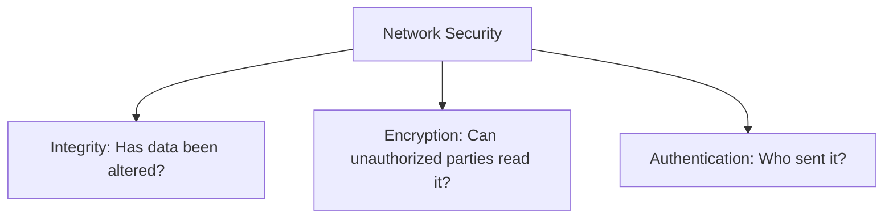

# Transport Security Concepts: Integrity, Encryption, and Authentication

This document explains the three core pillars of network communication security, compares their roles, and details how our custom Reliable UDP protocol addresses them.

---

## The CIA Triad and Transport Security

In network security, the foundational triad consists of **Confidentiality, Integrity, and Availability**, bolstered by **Authentication**.

---

## 1. Integrity (What Our Protocol Implements)

### Definition
**Integrity** ensures that information has not been modified, corrupted, truncated, or tampered with between transmission and reception.

### Mechanisms Used in Reliable UDP
1. **Per-Packet CRC32 (32-bit Cyclic Redundancy Check)**:
   - **Coverage**: Serialized header (with checksum zeroed) concatenated with chunk payload.
   - **Purpose**: High-speed detection of physical transmission errors, bit flips, Ethernet noise, and transient memory glitches.
   - **Receiver Action**: Any packet failing CRC32 verification is immediately dropped at the wire interface.
2. **End-to-End SHA-256 (256-bit Cryptographic Hash)**:
   - **Coverage**: Streaming calculation across the complete reconstructed binary file.
   - **Purpose**: Cryptographic guarantee that the assembled disk artifact matches the sender's exact source byte-for-byte.
   - **Receiver Action**: Verified during FIN/FIN_ACK teardown. If hashes differ, the file is rejected and purged from disk.

### Limitations of Integrity Alone
- **Accidental vs. Malicious**: Checksums and unkeyed hashes (like raw SHA-256) protect against **accidental channel corruption**.
- An active Man-in-the-Middle (MitM) attacker can modify payload bytes *and simultaneously recompute a valid CRC32 and SHA-256*, passing integrity checks undetected.

---

## 2. Encryption (Confidentiality)

### Definition
**Encryption** transforms plaintext data into ciphertext using a cryptographic cipher and secret key, ensuring that unauthorized interceptors (eavesdroppers) cannot decipher packet contents.

### Common Protocols & Ciphers
- **TLS 1.3 / DTLS 1.3**: Uses AEAD (Authenticated Encryption with Associated Data) ciphers like **AES-256-GCM** and **ChaCha20-Poly1305**.
- **WireGuard / QUIC**: Encrypts datagram payloads on UDP directly at the transport layer.

### Why Encryption is NOT Implemented in This Milestone
- Per system design constraints, our protocol operates as a cleartext, educational transport engine focused on ARQ reliability, sliding windows, and flow simulation.
- Encryption introduces non-trivial complexities: Diffie-Hellman Ephemeral (ECDHE) key exchange, certificate authority (CA) trust hierarchies, forward secrecy, and nonce management.

---

## 3. Authentication (Identity & Origin Proof)

### Definition
**Authentication** confirms the true identity of the transmitting party and proves that the message originated from the claimed source and was not forged or replayed.

### Common Mechanisms
1. **HMAC (Hash-based Message Authentication Code)**:
   - Uses a pre-shared secret key combined with a hash function:
     $$\text{HMAC}(K, M) = H((K \oplus opad) \parallel H((K \oplus ipad) \parallel M))$$
   - Unlike CRC32, an attacker cannot recompute an HMAC without possessing the secret key $K$.
2. **Digital Signatures (Asymmetric Cryptography)**:
   - Uses public/private key pairs (RSA, Ed25519, ECDSA).
   - Sender signs a hash of the packet with their private key; receiver verifies using sender's public key.
3. **Session Nonces & Anti-Replay Windows**:
   - Monotonically increasing sequence numbers and session salts prevent attackers from capturing valid packets and replaying them later to deceive endpoints.

---

## Comparative Matrix

| Property | Primary Threat Addressed | Typical Algorithms | Implemented in Our Protocol? |
| :--- | :--- | :--- | :---: |
| **Integrity** | Bit flips, channel noise, packet truncation | CRC32, SHA-256 | **YES** (Per-packet CRC32 + Full-file SHA-256) |
| **Confidentiality (Encryption)** | Eavesdropping, network packet sniffing | AES-GCM, ChaCha20 | **NO** (Intentionally out of scope) |
| **Authentication** | Spoofing, packet injection, MitM tampering | HMAC-SHA256, Ed25519 | **NO** (Intentionally out of scope) |

---

## Summary of Defensive Mitigations in Milestone 14

Although encryption is omitted, our implementation enforces defensive transport security:
1. **Path Traversal Sandboxing**: `safe_join_path` prevents directory breakout attacks (e.g. `../../etc/passwd`).
2. **Memory Exhaustion Defense**: `MAX_BUFFERED_PACKETS` (8192) and `MAX_BUFFER_BYTES` (16 MB) prevent heap exhaustion from out-of-order packet floods.
3. **Strict Binary Parsing**: Validates session IDs, sequence numbers, payload lengths, and rejects unauthenticated trailing garbage bytes without crashing.
4. **Crash Immunity**: Unpack errors and malformed inputs are caught and quarantined, ensuring receiver daemon uptime.
