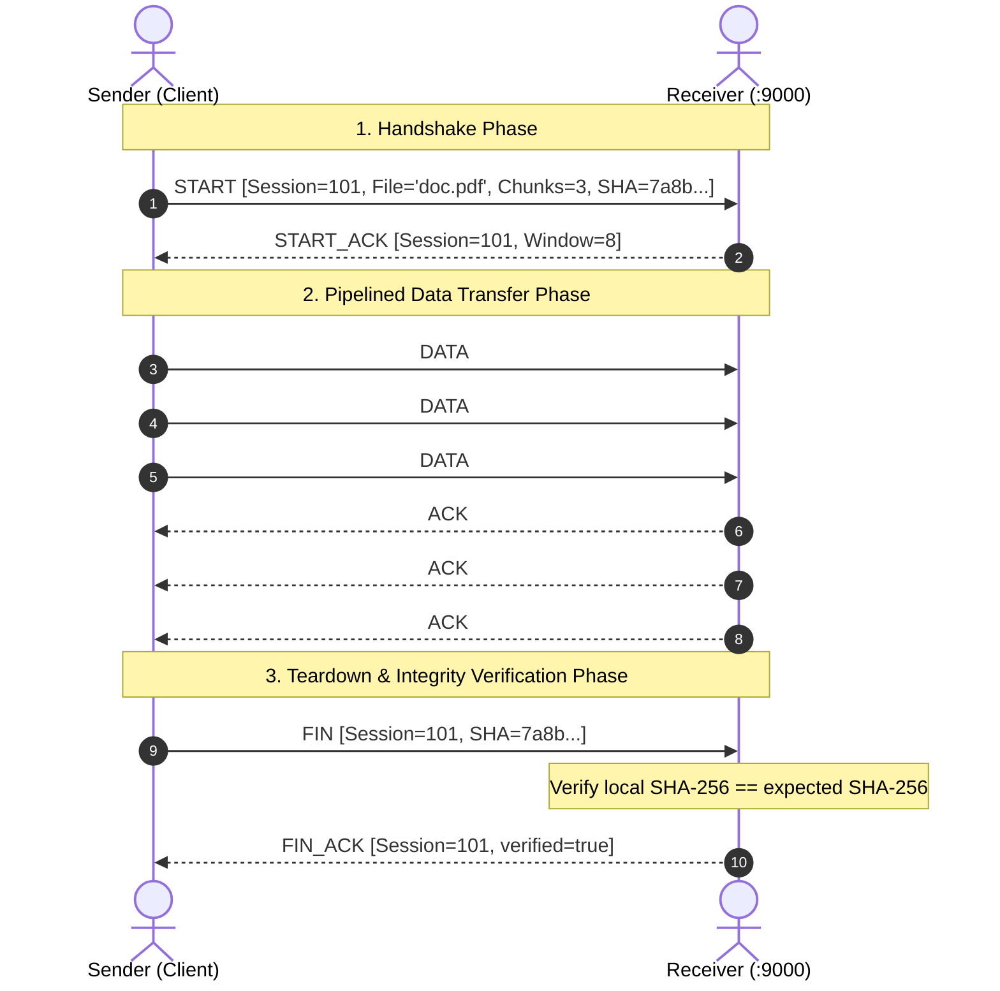

# Wireshark Inspection & Protocol Dissection Guide

This guide documents how to capture, inspect, decode, and troubleshoot the **Custom Reliable UDP File Transfer Protocol** using [Wireshark](https://www.wireshark.org/).

---

## 1. Wireshark Capture Setup & Filter

When capturing traffic on the loopback interface (`Adapter for loopback traffic capture` on Windows or `lo` on Linux/macOS) or LAN interface:

### Display Filter
```wireshark
udp.port == 9000
```
This filter isolates all communication sessions between the sender and receiver running on port 9000.

### Useful Additional Filters
| Goal | Wireshark Display Filter |
|---|---|
| Filter by Session ID (e.g. 123456 = 0x0001e240) | `udp.port == 9000 && data[4:4] == 00:01:e2:40` |
| Filter only DATA packets (`pkt_type == 0x02`) | `udp.port == 9000 && data[3] == 02` |
| Filter only ACK packets (`pkt_type == 0x03`) | `udp.port == 9000 && data[3] == 03` |
| Filter START handshake packets | `udp.port == 9000 && data[3] == 01` |
| Filter FIN / FIN_ACK teardown packets | `udp.port == 9000 && (data[3] == 05 || data[3] == 06)` |
| Filter by specific Sequence Number (e.g. #5) | `udp.port == 9000 && data[8:4] == 00:00:00:05` |

---

## 2. Packet Identification & Header Layout

Every custom protocol packet begins with an exact **22-byte binary header** (Network Byte Order / Big-Endian):

```
 0                   1                   2                   3
 0 1 2 3 4 5 6 7 8 9 0 1 2 3 4 5 6 7 8 9 0 1 2 3 4 5 6 7 8 9 0 1
+-+-+-+-+-+-+-+-+-+-+-+-+-+-+-+-+-+-+-+-+-+-+-+-+-+-+-+-+-+-+-+-+
|       Magic (0x5244 'RD')     |    Version    |   Pkt Type    |
+-+-+-+-+-+-+-+-+-+-+-+-+-+-+-+-+-+-+-+-+-+-+-+-+-+-+-+-+-+-+-+-+
|                          Session ID                           |
+-+-+-+-+-+-+-+-+-+-+-+-+-+-+-+-+-+-+-+-+-+-+-+-+-+-+-+-+-+-+-+-+
|                        Sequence Number                        |
+-+-+-+-+-+-+-+-+-+-+-+-+-+-+-+-+-+-+-+-+-+-+-+-+-+-+-+-+-+-+-+-+
|                     Acknowledgment Number                     |
+-+-+-+-+-+-+-+-+-+-+-+-+-+-+-+-+-+-+-+-+-+-+-+-+-+-+-+-+-+-+-+-+
|         Payload Length        |            Checksum           |
+-+-+-+-+-+-+-+-+-+-+-+-+-+-+-+-+-+-+-+-+-+-+-+-+-+-+-+-+-+-+-+-+
|      Checksum (cont'd)        |    Payload Data (0..65485)    |
+-+-+-+-+-+-+-+-+-+-+-+-+-+-+-+-+ ...                           |
```

### How to Identify Each Field in Wireshark's Packet Bytes View

| Field | Offset | Bytes | Value / Format | Interpretation |
|---|---|---|---|---|
| **Magic ID** | `0..1` | 2 B | `0x52 0x44` (`RD`) | Confirms this is our reliable UDP transport frame. |
| **Version** | `2` | 1 B | `0x01` | Protocol Version 1. |
| **Packet Type** | `3` | 1 B | `0x01..0x06` | `0x01` = START<br>`0x02` = DATA<br>`0x03` = ACK<br>`0x04` = START_ACK<br>`0x05` = FIN<br>`0x06` = FIN_ACK |
| **Session ID** | `4..7` | 4 B | `uint32` (big-endian) | Unique integer identifying the active transfer session. |
| **Sequence Number** | `8..11` | 4 B | `uint32` (big-endian) | 0-indexed data chunk identifier or transaction ID. |
| **ACK Number** | `12..15` | 4 B | `uint32` (big-endian) | Sequence number confirmed by the receiver. |
| **Payload Length** | `16..17` | 2 B | `uint16` (big-endian) | Number of bytes following byte offset 21. |
| **CRC32 Checksum** | `18..21` | 4 B | `uint32` (big-endian) | CRC32 calculated over header (with checksum=0) + payload. |
| **Payload** | `22..end`| Var | Binary data / UTF-8 JSON | File slice bytes or JSON control metadata. |

---

## 3. Detailed Wire Flow Scenarios

### Scenario A: Normal Transfer Lifecycle



---

### Scenario B: Retransmission Due to Lost ACK

When an ACK is dropped in transit by network impairment, the receiver has already processed the packet, but the sender times out and retransmits:

```
Sender                                    Receiver
  │                                          │
  │─── DATA #5 (Seq=5, Len=1024) ───────────>│ (Accepted, written to disk)
  │                                          │
  │    [ACK #5 is dropped by network] ───X   │ (Receiver sent ACK #5)
  │                                          │
  │ [Timer expires after timeout=1.0s]       │
  │                                          │
  │─── DATA #5 Retransmitted (Seq=5) ───────>│ (Recognized as DUPLICATE #5)
  │                                          │ (Ignored: not written to disk twice)
  │<── ACK #5 (Re-sent by Receiver) ─────────│ (Receiver acknowledges again)
  │                                          │
  ▼ [Sender advances window to #6]           ▼
```

### Identifying Retransmissions in Wireshark:
1. Two packets will appear with **identical Sequence Numbers** (`data[8:4] == 00:00:00:05`).
2. The time delta between the two packets will equal or slightly exceed the configured timeout duration (e.g. `1.002s` or `0.201s`).
3. The payload bytes and checksum will be identical.

---

### Scenario C: Packet Corruption Detected by Checksum

If a bit flips during transmission:
1. Sender transmits `DATA #2` with valid CRC32.
2. Channel flips a bit in the UDP payload.
3. Receiver receives datagram, decodes header, and computes CRC32.
4. Calculated CRC32 does not match header offset `18..21`.
5. Receiver logs `[DROP] Checksum corrupted packet` and discards it without sending an ACK.
6. Sender timeout triggers and retransmits clean `DATA #2`.

---

## 4. Custom Wireshark Lua Dissector

To automatically decode protocol fields in Wireshark without manual byte reading, use the included Lua dissector script: [reliable_udp.lua](file:///d:/UDP/docs/reliable_udp.lua).

### Installation Instructions
1. Copy `docs/reliable_udp.lua` to your Wireshark plugins directory:
   - **Windows**: `%APPDATA%\Wireshark\plugins\` (e.g., `C:\Users\<User>\AppData\Roaming\Wireshark\plugins\`)
   - **Linux**: `~/.local/lib/wireshark/plugins/`
   - **macOS**: `~/.config/wireshark/plugins/`
2. Restart Wireshark, or press **Ctrl + Shift + L** to reload Lua plugins.
3. Apply filter: `reliable_udp` or `udp.port == 9000`.

### What the Dissector Decodes
- Protocol tree item: `Custom Reliable UDP Protocol`
- Packet Type decoded into human labels: `DATA`, `ACK`, `START`, `START_ACK`, `FIN`, `FIN_ACK`
- Individual fields: Session ID, Sequence Number, Acknowledgment Number, Payload Length, Checksum (with verified status), and JSON metadata preview.
